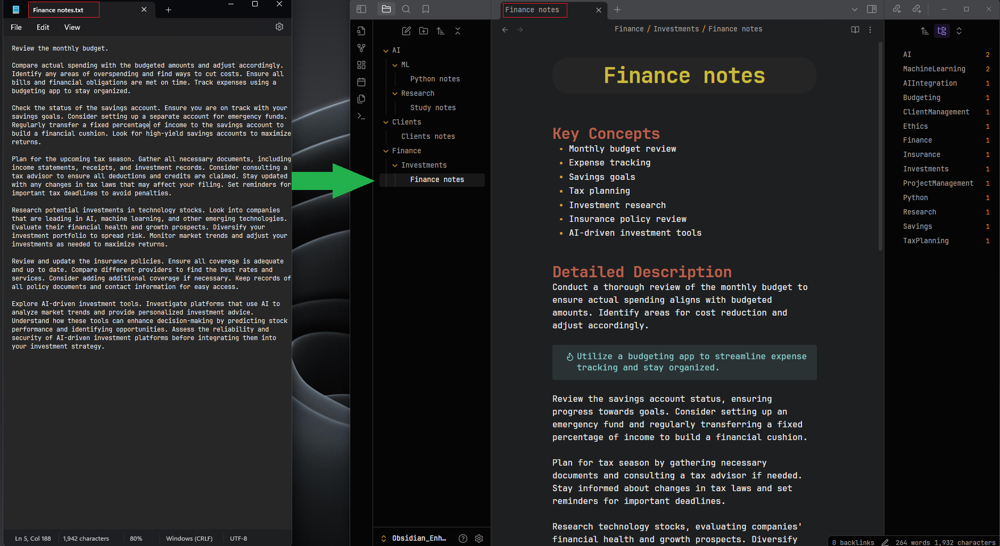

# Obsidian-Text-Transformer-LocalAI

The **Obsidian-Text-Transformer-LocalAI** is a Python tool designed to transform `.txt` and `.md` files into beautifully structured Markdown files, perfectly suited for use in Obsidian. It utilizes local Large Language Models (LLMs) through the Ollama API, enhancing and organizing your notes effectively.

<div align="center">
  
</div>

## Features

- **Ollama API Integration:** Uses various LLM models to process content.
- **Customizable Prompts:** Use `prompts_config.json` to create custom prompts that do exactly what you want with your files.
- **Organized Output:** Automatically saves processed files in the `OUTPUT_FOLDER`.


## YouTube Video Demo

[](https://youtu.be/Xf4_k99sXPE)


## Prerequisites

- **Python:** Must be installed on your system.
- **Ollama:** Ensure Ollama is installed and operational. [Download Ollama](https://ollama.com/)

## Installation & Setup

1. **Download and Install Ollama:**
   - Download Ollama from [Ollama's website](https://ollama.com/).

2. **Verify Ollama with a Model:**
   - Open your command line interface (CLI) and run the following command to start a model such as Gemma3 or Llama3.1:
     ```bash
     ollama run gemma3
     ```
     or
     ```bash
     ollama run llama3.1
     ```
   - This step is to ensure that Ollama and your chosen model are set up correctly on your system. You only need to do this once to verify that everything is working properly.

3. **Clone the Repository:**
   ```bash
   git clone https://github.com/Amine-LG/obsidian-text-transformer-localai.git
   ```
   ```bash
   cd obsidian-text-transformer-localai
   ```

4. **Install Python Dependencies:**
   ```bash
   pip install requests tabulate
   ```

5. **Configuration Setup:**
   - **`config.py` Configuration:**
     - `MODEL_API_URL`: Specify your active Ollama server address (e.g., `http://localhost:11434/api/chat`).
     - `MODEL`: Select the LLM to use (e.g. 'gemma3', 'llama3.1').
     - `DIRECTORY_PATH`: Define the directory containing your input files.
     - `OUTPUT_FOLDER`: choose where processed files will be stored.
     - Adjust `MAX_FILE_SIZE` and `MIN_FILE_SIZE` as needed.

     - **New Parameters**:
     - `NUM_CTX`: Set the extended context size (e.g., 16384 tokens) for handling larger inputs.
     - `KEEP_ALIVE`: Specify how long the model should remain active (e.g., "10m" for 10 minutes).
     - `TIMEOUT`: Define the request timeout (e.g., 120 seconds) to allow for processing large files.
     - `STREAM`: Enable or disable streaming responses (True or False).

   - **Create `prompts_config.json`:**
     ```json
     {
       "messages": [
         {"role": "system", "content": [{"text": "Your system prompt here"}]},
         {"role": "user", "content": [{"text": "Your user prompt here"}]},
         {"role": "assistant", "content": [{"text": "Your assistant prompt here"}]}
       ]
     }
     ```

## Configuration Details

- **Model Settings:**
  ```python
  MODEL = 'gemma3:4b'  # Specify the model used
  TEMPERATURE = 0.0  # Set the model's response variability
  ```
  
- **API and Extended Context Settings:**
  ```python
  MODEL_API_URL = 'http://localhost:11434/api/chat'
  NUM_CTX = 16384      # Extended context size (in tokens) for handling larger inputs
  KEEP_ALIVE = "10m"   # Duration for which the model session is kept alive (e.g., "10m" means 10 minutes)
  TIMEOUT = 120        # Request timeout in seconds (e.g., 120 seconds)
  STREAM = True        # Enable streaming responses (True/False)
  ```

- **File and Logging Settings:**
  ```python
  MAX_FILE_SIZE = 20000
  MIN_FILE_SIZE = 10
  DIRECTORY_PATH = r'D:\Files\Notes\root'
  OUTPUT_FOLDER = r'D:\Files\Notes\Obsidian_Enhanced'

  LOG_DIRECTORY = 'logs'
  PROCESS_LOG_FILE = 'process_log.txt'
  ERROR_LOG_FILE = 'process_errors_log.txt'
  ```

- **Prompt Configuration:**
  ```python
    PROMPTS_CONFIG_FILE = 'prompts_config.json'
  ```

## Usage

1. **Prepare your `prompts_config.json`** and ensure it is configured according to your needs.
2. **Execution Command:**
   ```bash
   python main.py
   ```
   The script will:
   - Initialize logging.
   - Categorize `.txt` and `.md` files from `DIRECTORY_PATH`.
   - Display file eligibility based on size constraints.
   - Process files using the configured prompts.
   - Store processed content in `OUTPUT_FOLDER`.

## Outputs

- **Processed Files:** Stored in `OUTPUT_FOLDER`.
- **Logs:** Available in the `logs` directory.

## Important Notes

- **Output Folder Warning:** The script will delete everything in `OUTPUT_FOLDER` each time it runs. Always back up important files first.
- **Check the Server:** Make sure the Ollama server is active by visiting [http://localhost:11434/](http://localhost:11434/). You should see "Ollama is running."
- **Model Options:** Explore the [Ollama Model Library](https://ollama.com/library) to select models you’d like to use.
- **Write Your Own Prompts:** Customize `prompts_config.json` to create prompts that do exactly what you need.


## License

This project is released under the MIT License.